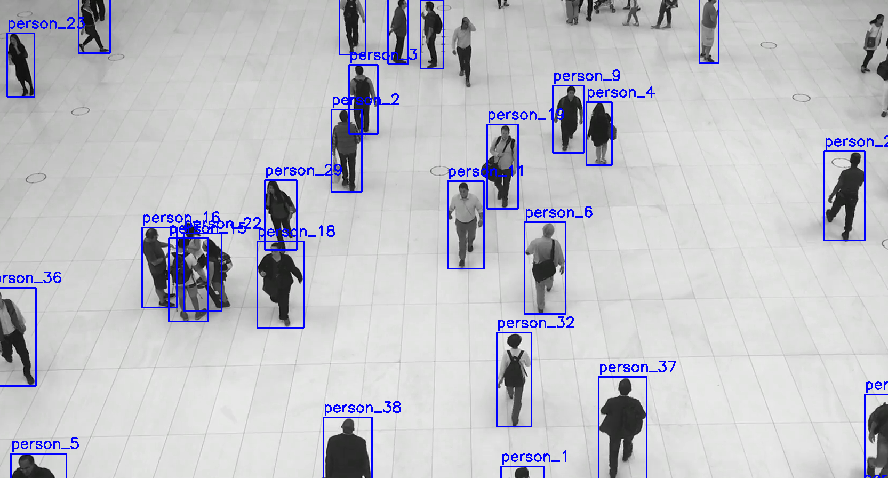

# Object Detection and Tracking with YOLOv8

This repository contains scripts for object detection and tracking using YOLOv8. The scripts allow exporting detection results to a JSON file and displaying these results on the video.



## Preparation:

Create a virtual environment and install the required packages:
```bash
python3 -m venv venv
source venv/bin/activate
pip install -r requirements.txt
```

You should then be able to run the following script:
   
```bash
python3 draw-results.py -v resources/test-video-1.mp4 -j resources/test-video-1.mp4.json
```

## Resources:
- `resources/test-video-1.mp4`: A sample video file for testing the scripts.
- `resources/test-video-1.mp4.json`: The detection results for the sample video, generated by `export-detections.py`.

## Scripts

### export-detections.py (you don't need to run this script)

This script runs the YOLOv8 model on a video file and exports the detection results to a JSON file. The detections include the bounding boxes, class labels, and confidence scores for each object in every frame.

**Usage:**
```bash
python3 export-detections.py -v <path_to_video> -m <path_to_yolo_model>
```

- `-v`, `--video`: Path to the input video file.
- `-m`, `--model`: Path to the YOLOv8 model weights.

### draw-results.py

This script reads the detection results from the JSON file and displays the annotated video frames. The bounding boxes and labels are drawn on the video frames, and the video is played back at the original frame rate.

**Usage:**
```bash
python3 draw-results.py -v <path_to_video> -j <path_to_json>
```

- `-v`, `--video`: Path to the input video file.
- `-j`, `--json`: Path to the JSON file with detection results.

Example:
```bash
python3 draw-results.py -v resources/test-video-1.mp4 -j resources/test-video-1.mp4.json
```

## Exercises

### Part 1 Exercise: Counting Humans Crossing a Line


**Objective:** Write a `count-crossings.py` python script to count the number of humans crossing a horizontal line in the middle of the video frame. The script should track people across frames and count each crossing event, ensuring that each person is counted only once.

**Requirements:**
1. Use the JSON file generated by `export-detections.py` to access detection results.
2. Implement a function to calculate the centroid of the bounding box for each detected person (class label "person").
3. Define a horizontal line at the midpoint of the video frame.
4. Track the centroids of detected persons across frames to determine if they cross the defined line. A crossing event occurs when a person's centroid moves from one side of the line to the other.
5. Draw bounding boxes around detected humans:
   - In green if they have crossed the line.
   - In grey if they haven't crossed the line.
6. Display the current count of humans who have crossed the line on the video frame.

**Submission:**
Please submit your python script along with a brief explanation of your approach, any assumptions made, and how you ensured that each person is counted only once. Additionally, include any relevant calculations or reasoning used to determine crossing events.

### Part 2 Exercise: Social Distance Monitoring


**Objective:** Write a python script to monitor social distancing by detecting if two or more humans are too close to each other in each frame of the video. The script should draw bounding boxes around detected humans in red if they are closer than a specified distance threshold, and in green if they are not.

**Requirements:**
1. Use the JSON file generated by `export-detections.py` to access detection results.
2. Implement a function to calculate the Euclidean distance between the centroids of bounding boxes of detected humans (class label "person").
3. Define a distance threshold that, when exceeded, classifies the detected persons as being too close.
4. For each frame, draw bounding boxes around humans:
   - In red if they are too close to at least one other person.
   - In green if they are at a safe distance from all other persons.

**Submission:**
Please submit your python script along with a brief explanation of your approach, the chosen distance threshold, and any considerations for handling edge cases. Additionally, include any relevant calculations or reasoning used to define the distance threshold.


### Part 3 Exercise: Heatmap Visualization


**Objective:** You will analyze a provided script that generates a visual heatmap based on object detections in a video. Your task is to describe what the script is doing and identify why the result looks so ugly.

**Details:**

- The script processes a video and corresponding JSON detection results to create a heatmap visualization. 
- It works by scaling the video frames to a lower resolution, computing a heatmap based on the positions of detected objects, and then overlaying the heatmap on the video frames.

**Script Command:**
```bash
python3 ./heatmap.py -v resources/test-video-1.mp4 -j resources/test-video-1.mp4.json
```

**Instructions:**

1. **Review the provided script.** It uses OpenCV and NumPy to manipulate video frames and generate a heatmap.
2. **Describe the following aspects of the script:**
   - How the script handles the JSON detection results and integrates them into the heatmap calculation.
   - The method used to propagate values across the heatmap and how distances influence the final heatmap values.
   - How the heatmap is normalized and overlaid on the original video frames.
3. **Identify and fix the issue causing the ugly output.** Explain why the output looks distorted and propose a solution to improve the visualization quality.
